<div align="center">

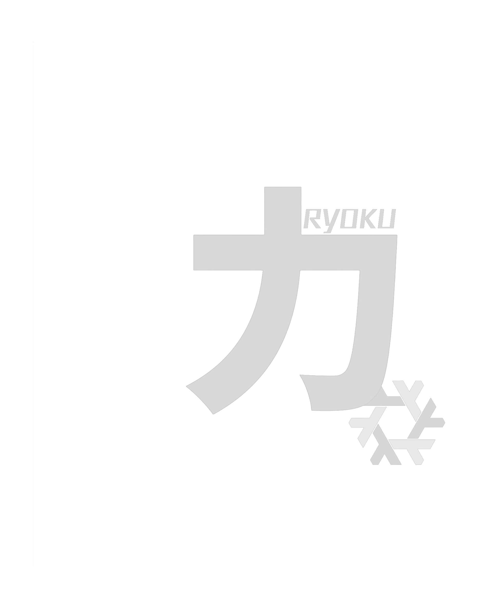

<br />

# Ryoku on NixOS

### 力と美のために
**For the sake of power and beauty.**

Ryoku on NixOS is the maintained NixOS port of [**Ryoku**](https://github.com/Ryoku-dev/ryoku), a Hyprland + Quickshell desktop.
The shared desktop stays close to upstream; NixOS-specific packaging, modules, installer behavior, system bridges and update integration live under `nix/`.

<br />

[**Install**](#install) · [**Explore the desktop**](#the-desktop) · [**Documentation**](docs/README.md) · [**Maintainer notes**](docs/maintenance.md) · [**Upstream Ryoku**](https://github.com/Ryoku-dev/ryoku)

<br />

```bash
nix run github:aethctl/Ryoku-on-NixOS/main#install
```

<sub>Existing flake-based NixOS system required.</sub>

</div>

---

## What this port owns

Ryoku's desktop code and interaction model remain shared with upstream. This
repository owns the NixOS boundary: packaging, module integration, installer and
update behavior, service wiring, compatibility fixes and Nix-specific runtime
bridges.

That gives the same desktop two different system foundations:

<table>
  <tr>
    <td width="50%" valign="top">
      <b>Ryoku on Arch</b><br /><br />
      Pacman and AUR integration<br />
      Arch-native services and system tooling<br />
      Arch update and recovery flow
    </td>
    <td width="50%" valign="top">
      <b>Ryoku on NixOS</b><br /><br />
      Nix packages and NixOS modules<br />
      Declarative packaging and integration<br />
      NixOS generations and rollback
    </td>
  </tr>
</table>

The shell, Hub, Ryostore, launcher, theming, lockscreen and bar styles are kept
in sync with upstream wherever the host operating system does not require a
different implementation.

---

<div align="center">

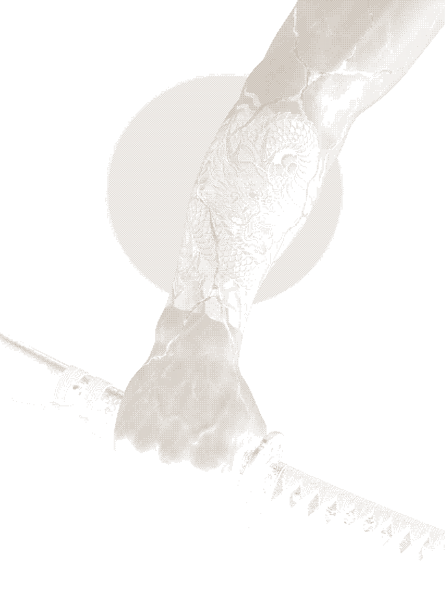

</div>

## Power

Ryoku on NixOS is packaged as a normal Nix flake and integrates into the system
you already own.

<table>
  <tr>
    <td width="33%" valign="top">
      <h3>Declarative</h3>
      Packages, services and desktop integration are expressed through NixOS rather
      than copied into mutable system locations.
    </td>
    <td width="33%" valign="top">
      <h3>Reproducible</h3>
      The public flake exposes the Ryoku module, packages, installer, development
      environment and checks from one source of truth.
    </td>
    <td width="33%" valign="top">
      <h3>Recoverable</h3>
      Updates produce ordinary NixOS generations, so the normal NixOS rollback model
      remains available.
    </td>
  </tr>
</table>

Ryoku does not repartition disks, replace your bootloader, change your kernel, or
take ownership of hardware-specific graphics configuration.

---

<div align="center">


</div>

## Beauty

The NixOS port does not reinterpret Ryoku. It preserves it.

Wallpaper-driven colour, quiet typography, animated surfaces and the surrounding
frame all belong to the same visual system. The desktop is designed to feel like
one product rather than a collection of unrelated widgets or amalgamation of config files.

---

## The desktop

<table>
  <tr>
    <td width="50%">
      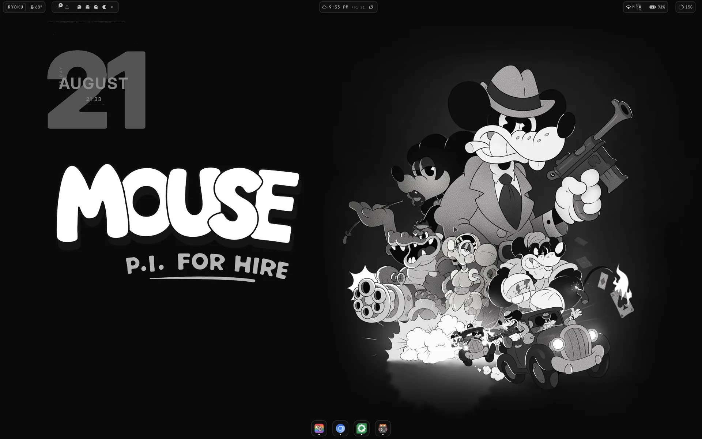
      <br />
      <sub><b>Desktop.</b> Aesthetic by default and heavily customisable.</sub>
    </td>
    <td width="50%">
      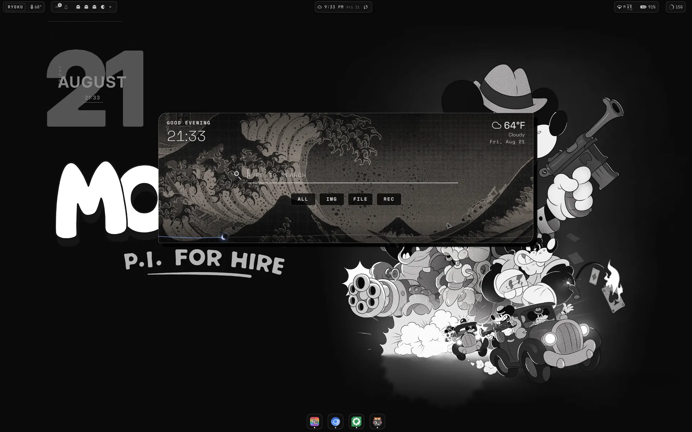
      <br />
      <sub><b>App Launcher.</b> Apps, commands, files, packages, calculator and more in one launcher.</sub>
    </td>
  </tr>
  <tr>
    <td width="50%">
      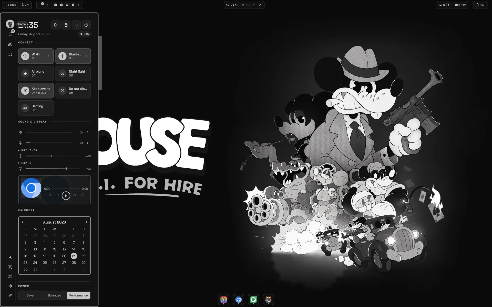
      <br />
      <sub><b>Controls.</b> Session, connectivity, sound, brightness, media and power in one sidebar.</sub>
    </td>
    <td width="50%">
      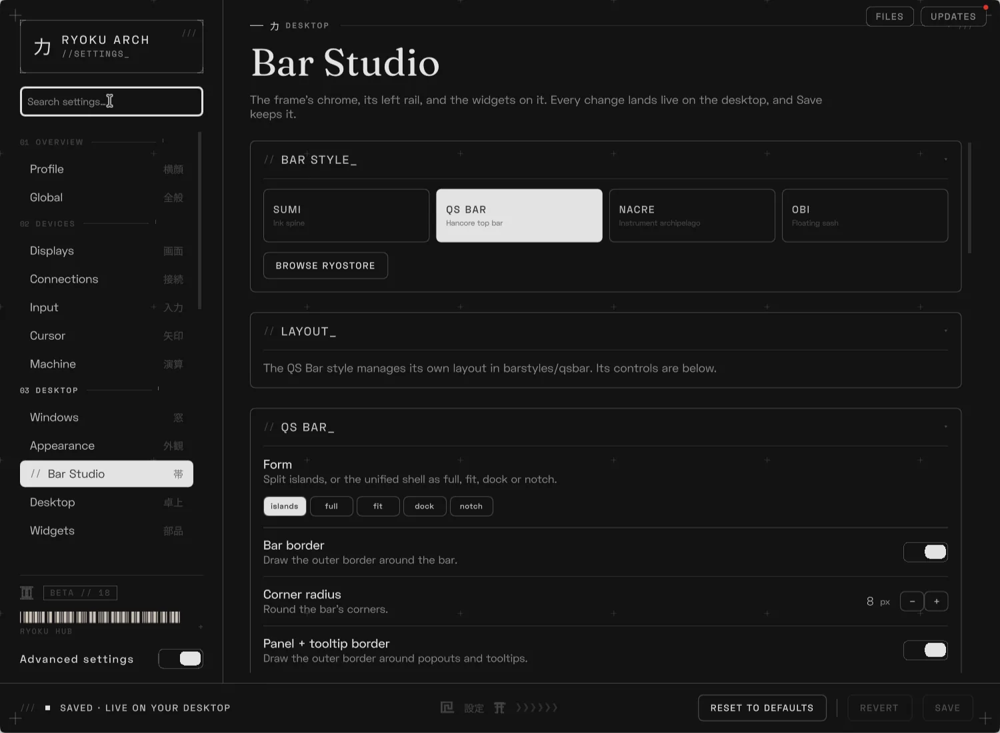
      <br />
      <sub><b>Ryoku Hub.</b> System information, settings and Ryoku-specific control in one place.</sub>
    </td>
  </tr>
  <tr>
    <td width="50%">
      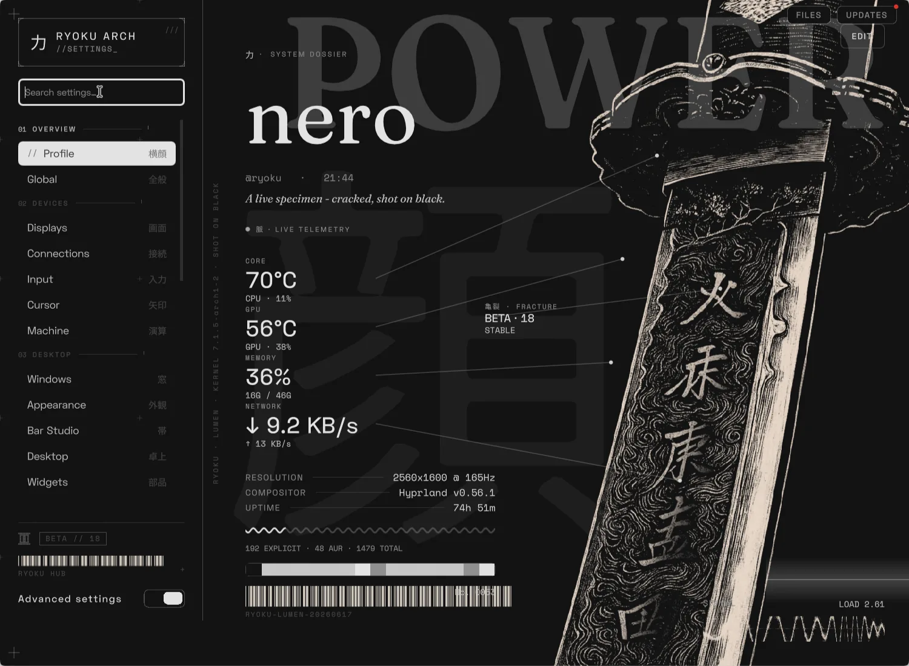
      <br />
      <sub><b>Profile.</b> User-facing customizable configuration bundled in one sleek page</sub>
    </td>
    <td width="50%">
      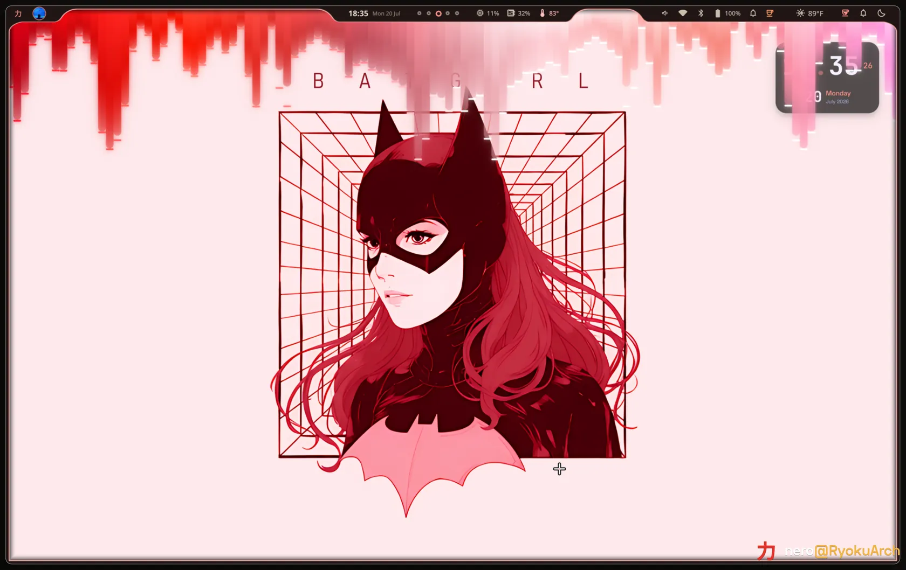
      <br />
      <sub><b>Matugen.</b> No matter the wallpaper, components recolour themselves around it</sub>
    </td>
  </tr>
</table>

---

## Showroom

Ryoku is designed to change character without changing identity.

<table>
  <tr>
    <td width="33%">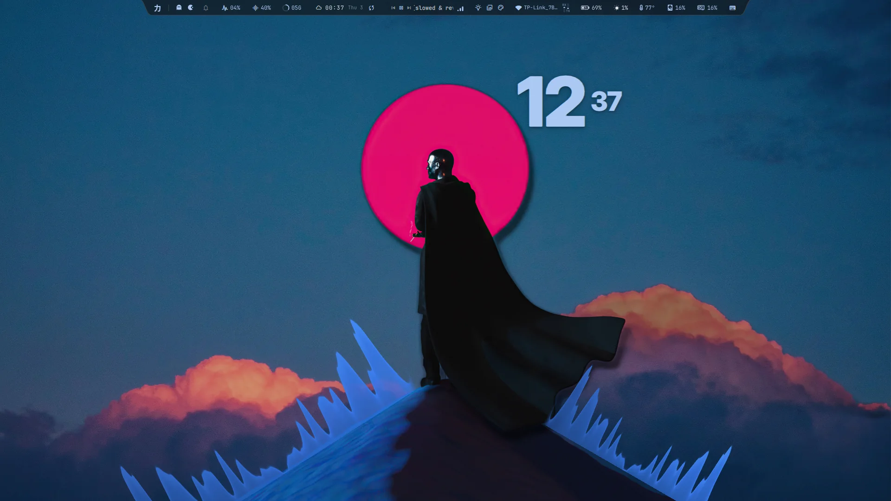</td>
    <td width="33%">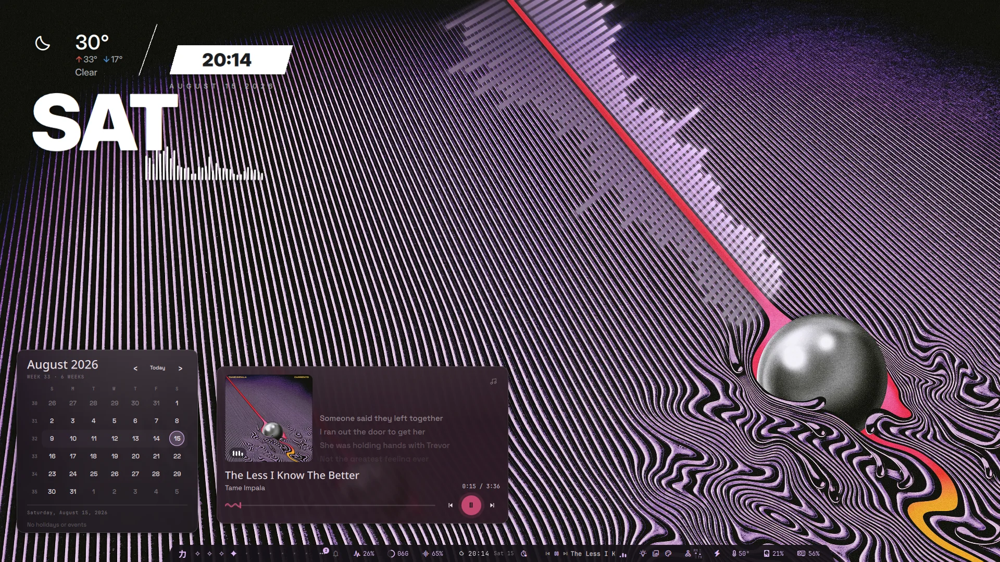</td>
    <td width="33%">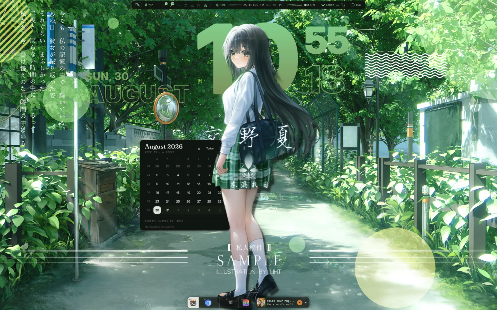</td>
  </tr>
  <tr>
    <td align="center"><sub>BLUE HOUR</sub></td>
    <td align="center"><sub>CHROME</sub></td>
    <td align="center"><sub>FOREST</sub></td>
  </tr>
  <tr>
    <td width="33%">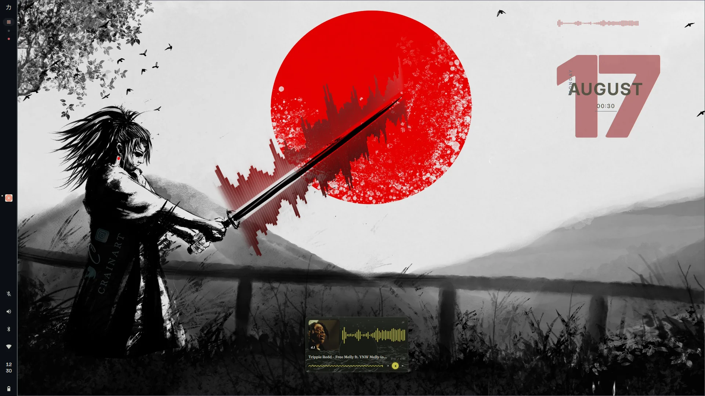</td>
    <td width="33%">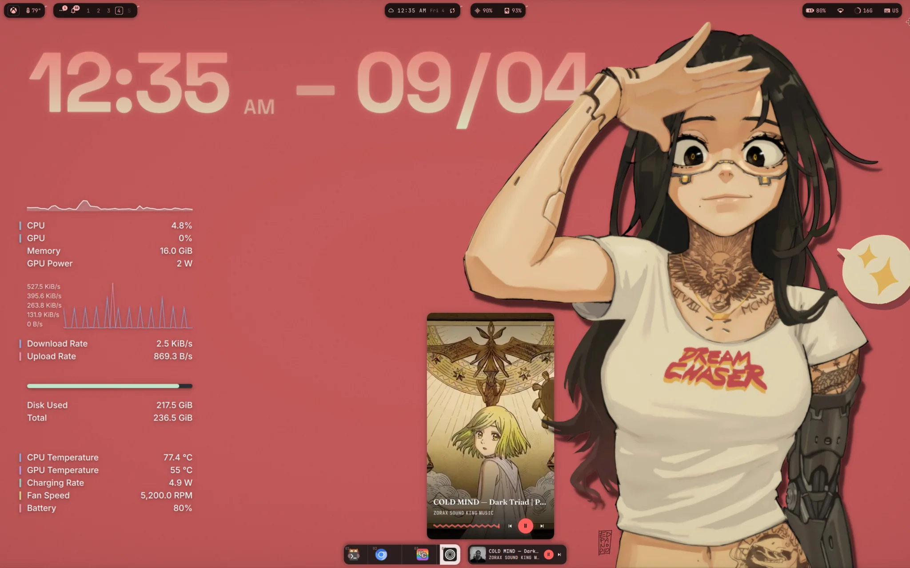</td>
    <td width="33%">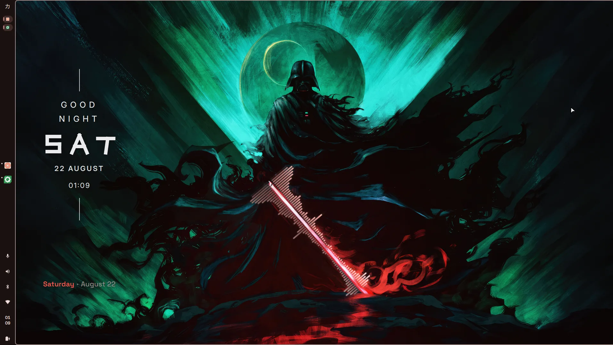</td>
  </tr>
  <tr>
    <td align="center"><sub>RED AUGUST</sub></td>
    <td align="center"><sub>ROSE</sub></td>
    <td align="center"><sub>TEAL</sub></td>
  </tr>
</table>

---

<div align="center">

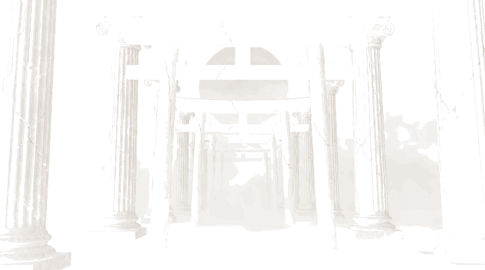

</div>

## The Ryoku ecosystem

Ryoku is more than the shell. The desktop is built from a set of focused tools
that share the same visual and interaction language.

<table>
  <tr>
    <td width="33%" valign="top">
      <b>Ryostore</b><br />
      Themes, bar styles, Fastfetch presets, lockscreens, plugins and decor all available from one shared catalogue.
    </td>
    <td width="33%" valign="top">
      <b>Ryotunes</b><br />
      Native playback and music integration designed around the Ryoku desktop.
    </td>
    <td width="33%" valign="top">
      <b>RyoMotion</b><br />
      Screen recording and editing integrated with Ryoku's capture workflow.
    </td>
  </tr>
  <tr>
    <td width="33%" valign="top">
      <b>Ryogami</b><br />
      Wallpaper and visual tooling that feeds the wider Ryoku theme system.
    </td>
    <td width="33%" valign="top">
      <b>Rashin</b><br />
      Ryoku's assistant and terminal-facing intelligence layer.
    </td>
    <td width="33%" valign="top">
      <b>Ryoku Hub</b><br />
      System dossier, settings and desktop control from one integrated surface.
    </td>
  </tr>
</table>

Ryostore is shared across Arch and NixOS for desktop-level content. Package and
app bundles are the main area that still needs Nix-native adaptation.

---

<div align="center">

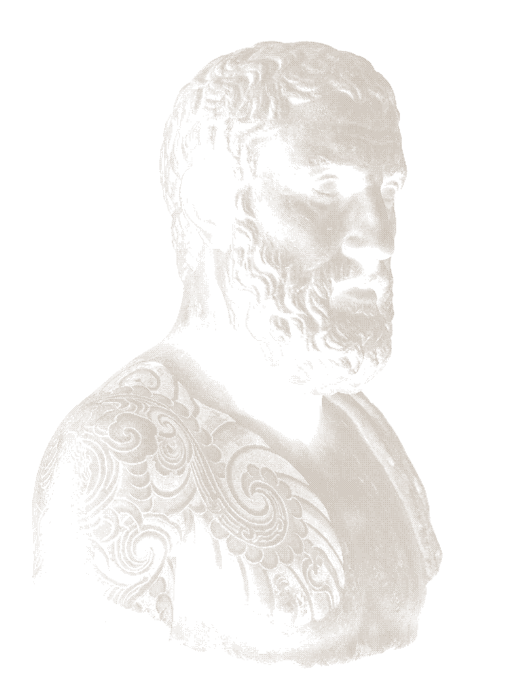

</div>

## Install

Ryoku on NixOS installs on top of an existing **flake-based NixOS system**.

Run the installer as your normal user:

```bash
nix run github:aethctl/Ryoku-on-NixOS/main#install
```

The installer:

- adds Ryoku to your existing flake,
- creates the installer-managed ryoku.nix,
- updates the flake lock,
- builds the new NixOS generation,
- switches only after the build succeeds,
- restores the previous configuration files if the integration fails.

For custom flake paths, multi-host setups and manual integration, see the
[**NixOS guide**](docs/nixos.md).

---

## What ships

| Area | What it contains |
| --- | --- |
| `ryoku/` | Shared Ryoku desktop, shell, applications, Hyprland integration and assets |
| `nix/` | Nix packages, NixOS module, installer, system bridge and Nix-specific integration |
| `flake.nix` | Public Nix entry point for modules, packages, apps, checks and development |
| `docs/` | Shared desktop docs, NixOS docs and upstream Arch reference material |
| `tests/` | Focused validation for the port and shared desktop behavior |

The repository is intentionally split at the platform boundary. Shared desktop
features stay shared. Nix-specific behavior lives under `nix/`.

The Nix layer packages the major Ryoku components independently rather than
treating the desktop as one opaque wrapper. The root flake exposes the shell,
Hub, CLI, Ryostore, Ryotunes, Ryogami, RyoMotion, helper packages, compositor
integration and the combined bundle as separate outputs.

---

## How the port is maintained

This is a maintained platform port, not a one-time source translation. Upstream
changes are reviewed at the operating-system boundary:

1. Shared desktop and application changes stay in `ryoku/` whenever possible.
2. Arch-specific package, service and filesystem assumptions are replaced with
   Nix packages, NixOS modules or narrow runtime bridges.
3. Bugs that also affect upstream Ryoku are fixed upstream when practical; fixes
   that only exist because of NixOS semantics stay in this repository.
4. User-visible runtime changes are tested on NixOS before they are released.

The detailed ownership rules and sync workflow live in
[**docs/maintenance.md**](docs/maintenance.md).

---

## Validation

The public flake makes the core port buildable through one entry point:

```bash
nix flake check
```

Its checks build the main runtime packages, QML modules, desktop integration,
installer and materializer, and run focused installer/parser checks. CI adds
shell linting, QML linting, Go tests, installer safety checks and targeted
integration guards.

For compositor, display, audio, GPU or installer behavior, a green CI run is not
treated as runtime proof. Pull requests should record the machine/runtime test
that was actually performed.

---

## Development

Clone the repository and enter the development shell:

```bash
nix develop
```

Run Ryoku directly from a development checkout:

```bash
nix run .#ryoku-dev
```

Useful public flake outputs include:

```text
.#install
.#ryoku-dev
.#ryoku-materialize
```

See [**docs/README.md**](docs/README.md) for the documentation map and
[**docs/structure.md**](docs/structure.md) for the repository layout.

---

## Upstream and credits

Ryoku on NixOS is the NixOS port of
[**Ryoku**](https://github.com/Ryoku-dev/ryoku).

Ryoku was created by [**Neur0map**](https://github.com/neur0map). The NixOS port
keeps upstream desktop behavior close while adapting system integration to NixOS.

Full attribution is available in [`NOTICE`](NOTICE).

**Ryoku is released under the [GNU GPL v3](LICENSE).**

---

<div align="center">

### 力と美のために

**Power in the system. Beauty in the surface.**

</div>
